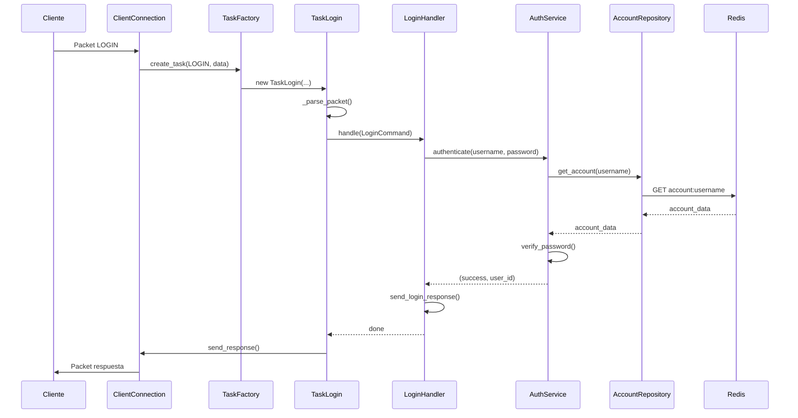
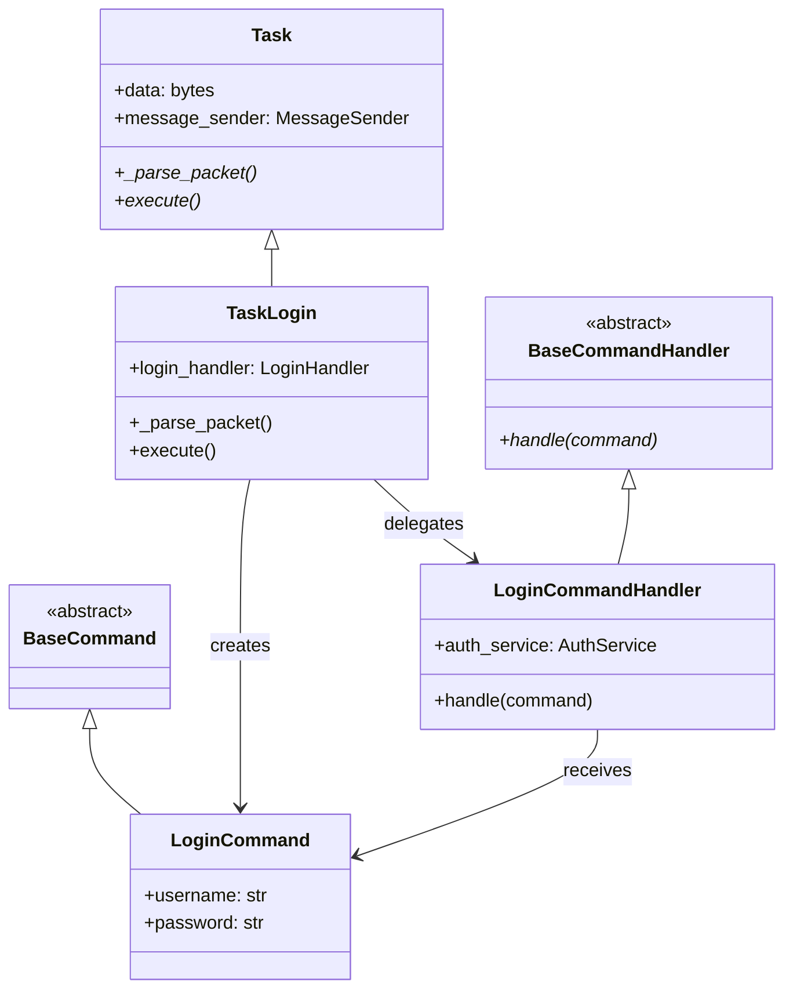
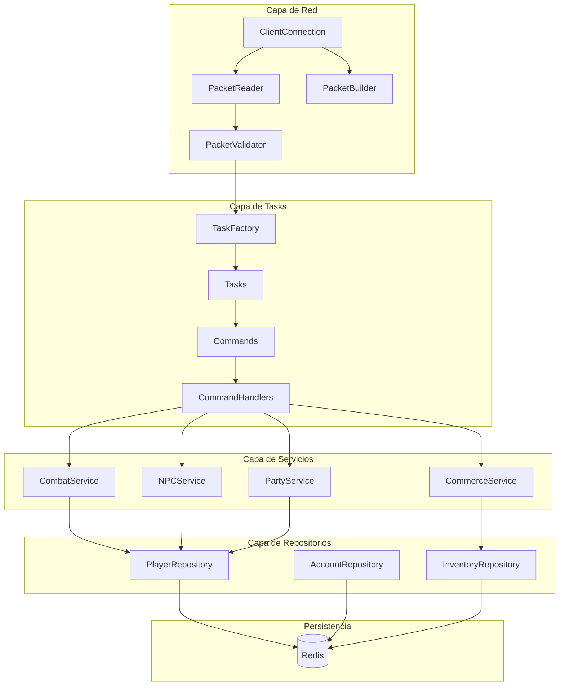

# Arquitectura del Proyecto - PyAO Server

Este documento describe la arquitectura del servidor PyAO, sus capas, patrones de diseño y flujos de datos.

## 📋 Tabla de Contenidos

1. [Visión General](#visión-general)
2. [Arquitectura en Capas](#arquitectura-en-capas)
3. [Flujo de Datos](#flujo-de-datos)
4. [Patrones de Diseño](#patrones-de-diseño)
5. [Componentes Principales](#componentes-principales)
6. [Diagramas](#diagramas)

---

## 🎯 Visión General

PyAO Server utiliza una **arquitectura en capas** con separación clara de responsabilidades:

- **Capa de Red**: Manejo de conexiones y protocolo
- **Capa de Tasks**: Handlers de packets (Command Pattern)
- **Capa de Servicios**: Lógica de negocio reutilizable
- **Capa de Repositorios**: Acceso a datos (Redis)
- **Capa de Persistencia**: Redis (configuración y estado)

---

## 🏗️ Arquitectura en Capas

```
┌─────────────────────────────────────────────────────────┐
│              Capa de Red (Network Layer)                │
│  - ClientConnection                                      │
│  - PacketReader / PacketBuilder / PacketValidator       │
│  - SessionManager                                        │
└─────────────────────────────────────────────────────────┘
                          ↓
┌─────────────────────────────────────────────────────────┐
│         Capa de Tasks (Command Pattern)                 │
│  - TaskFactory (crea tasks con dependencias)           │
│  - Tasks (parsean packets, crean commands)              │
│  - Commands (objetos de comando)                        │
│  - CommandHandlers (ejecutan lógica)                    │
└─────────────────────────────────────────────────────────┘
                          ↓
┌─────────────────────────────────────────────────────────┐
│      Capa de Servicios (Business Logic Layer)            │
│  - CommerceService, CombatService, NPCService, etc.    │
│  - Encapsulan lógica de negocio                        │
│  - Reutilizables entre múltiples tasks                 │
│  - Testeables independientemente                       │
└─────────────────────────────────────────────────────────┘
                          ↓
┌─────────────────────────────────────────────────────────┐
│     Capa de Repositorios (Data Access Layer)            │
│  - PlayerRepository, AccountRepository, etc.           │
│  - Abstraen acceso a Redis                             │
│  - CRUD de entidades                                    │
└─────────────────────────────────────────────────────────┘
                          ↓
┌─────────────────────────────────────────────────────────┐
│          Capa de Persistencia (Redis)                    │
│  - Configuración del servidor                           │
│  - Estado del juego                                     │
│  - Datos de jugadores, NPCs, items                     │
└─────────────────────────────────────────────────────────┘
```

### Responsabilidades por Capa

#### Capa de Red
- **Responsabilidades:**
  - Aceptar conexiones de clientes
  - Leer y escribir packets del protocolo AO
  - Validar estructura de packets
  - Gestionar sesiones de usuario

- **Componentes principales:**
  - `ClientConnection`: Conexión individual con un cliente
  - `PacketReader`: Lectura estructurada de packets
  - `PacketBuilder`: Construcción de packets de respuesta
  - `PacketValidator`: Validación de estructura y contenido
  - `SessionManager`: Gestión de sesiones activas

#### Capa de Tasks
- **Responsabilidades:**
  - Parsear packets recibidos
  - Crear objetos Command
  - Delegar ejecución a CommandHandlers
  - Orquestar el flujo de la acción

- **Componentes principales:**
  - `TaskFactory`: Crea tasks con dependencias inyectadas
  - `Task`: Clase base abstracta
  - `Task<Accion>`: Tasks específicos por acción
  - `Command`: Objetos de comando (Command Pattern)
  - `CommandHandler`: Handlers que ejecutan comandos

#### Capa de Servicios
- **Responsabilidades:**
  - Encapsular lógica de negocio
  - Coordinar múltiples repositorios
  - Validar reglas de negocio
  - Proporcionar APIs reutilizables

- **Componentes principales:**
  - `CommerceService`: Comercio con mercaderes
  - `CombatService`: Sistema de combate
  - `NPCService`: Gestión de NPCs
  - `PartyService`: Sistema de parties
  - `SpellService`: Sistema de hechizos
  - Y más...

#### Capa de Repositorios
- **Responsabilidades:**
  - Abstraer acceso a Redis
  - Proporcionar métodos CRUD
  - Manejar serialización/deserialización
  - Gestionar claves de Redis

- **Componentes principales:**
  - `PlayerRepository`: Datos de jugadores (con helpers `_hget_float/_hget_int/_hget_bool/_hset_field` para eliminar duplicación en 20+ métodos de status effects, modifiers y estados booleanos)
  - `BaseSlotRepository`: Clase base para inventarios y bancos
  - `AccountRepository`: Cuentas de usuario
  - `InventoryRepository`: Inventarios
  - `BankRepository`: Bóvedas bancarias (extiende `BaseSlotRepository`)
  - `NPCRepository`: NPCs
  - `EquipmentRepository`: Equipamiento
  - Y más...

---

## 🔄 Flujo de Datos

### Flujo Típico: Login de Usuario

```
1. Cliente envía packet LOGIN
   ↓
2. ClientConnection recibe bytes
   ↓
3. PacketValidator valida estructura
   ↓
4. TaskFactory crea TaskLogin con dependencias
   ↓
5. TaskLogin._parse_packet() extrae username/password
   ↓
6. TaskLogin crea LoginCommand
   ↓
7. TaskLogin delega a LoginCommandHandler
   ↓
8. LoginCommandHandler usa AuthenticationService
   ↓
9. AuthenticationService usa AccountRepository
   ↓
10. AccountRepository consulta Redis
   ↓
11. Respuesta fluye de vuelta (Repository → Service → Handler → Task)
   ↓
12. Task usa MessageSender para enviar respuesta
   ↓
13. ClientConnection envía packet al cliente
```

### Flujo Típico: Ataque a NPC

```
1. Cliente envía packet ATTACK
   ↓
2. TaskAttack parsea packet (target_char_index)
   ↓
3. TaskAttack crea AttackCommand
   ↓
4. AttackCommandHandler usa CombatService
   ↓
5. CombatService valida y calcula daño
   ↓
6. CombatService usa NPCRepository para actualizar HP
   ↓
7. CombatService usa NPCDeathService si NPC muere
   ↓
8. NPCDeathService coordina:
   - Experiencia al jugador
   - Drop de loot/oro
   - Respawn del NPC
   - Broadcast a otros jugadores
   ↓
9. Respuestas se envían a través de MessageSender
```

---

## 🎨 Patrones de Diseño

### 1. Command Pattern

**Implementación:** Tasks → Commands → Handlers

**Propósito:** Encapsular requests como objetos, permitiendo parametrizar clientes con diferentes requests.

**Ejemplo:**
```python
# Task parsea y crea Command
command = LoginCommand(username="player", password="pass")

# Handler ejecuta el comando
await login_handler.handle(command)
```

**Beneficios:**
- Separación de parsing y ejecución
- Fácil testing (mock handlers)
- Reutilización de lógica entre tasks

### 2. Repository Pattern

**Implementación:** Repositories abstraen Redis

**Propósito:** Abstraer la lógica de acceso a datos, centralizando funcionalidades comunes.

**Ejemplo:**
```python
# Service usa Repository (no accede directamente a Redis)
player = await self.player_repo.get_player(user_id)
await self.player_repo.update_hp(user_id, new_hp)
```

**Beneficios:**
- Cambios en almacenamiento no afectan lógica de negocio
- Fácil testing (mock repositories)
- Código más limpio y mantenible

### 3. Dependency Injection + Auto-wiring

**Implementación:** `DependencyContainer` + `TaskFactory` con auto-wiring

**Propósito:** Invertir el control de dependencias, facilitando testing y mantenibilidad.

**Ejemplo:**
```python
# TaskFactory resuelve dependencias automáticamente por introspección del constructor.
# No requiere mapeo manual de dependencias.
task = TaskFactory.create_task(
    packet_id=PacketID.LOGIN,
    data=data,
    message_sender=sender
)
# Task ya tiene todas sus dependencias inyectadas
```

**Auto-wiring:** TaskFactory inspecciona el constructor de cada Task y resuelve
parámetros automáticamente en este orden de prioridad:
1. **Parámetros fijos:** `data`, `message_sender`, `session_data`
2. **Handlers:** parámetros `*_handler` se resuelven via HandlerRegistry
3. **Datos pre-validados:** parámetros que coinciden con claves de `parsed_data`
4. **Dependencias del contenedor:** atributos de `DependencyContainer`

**Beneficios:**
- Agregar un nuevo Task no requiere modificar mapeos de dependencias
- Fácil testing (inyectar mocks)
- Bajo acoplamiento
- Código más modular (~254 líneas vs ~1800 originales)

### 4. Factory Pattern

**Implementación:** `TaskFactory`, `NPCFactory`

**Propósito:** Centralizar la creación de objetos complejos.

**Ejemplo:**
```python
# TaskFactory crea tasks según packet ID
task = TaskFactory.create_task(PacketID.ATTACK, data, sender)

# NPCFactory crea NPCs con FX configurados
npc = NPCFactory.create_npc(npc_id, char_index, position)
```

**Beneficios:**
- Encapsula lógica de creación
- Facilita cambios en inicialización
- Centraliza configuración

### 5. Facade Pattern

**Implementación:** `MessageSender`, `ServerInitializer`

**Propósito:** Proporcionar una interfaz simplificada a un subsistema complejo.

**Ejemplo:**
```python
# MessageSender simplifica envío de mensajes
await message_sender.send_character_create(...)
await message_sender.send_update_user_stats(...)
# En lugar de llamar directamente a múltiples senders
```

**Beneficios:**
- API más simple y clara
- Oculta complejidad interna
- Facilita cambios en implementación

### 6. Strategy Pattern

**Implementación:** Dictionary-based task creation, item stacking

**Propósito:** Definir una familia de algoritmos, encapsularlos y hacerlos intercambiables.

**Ejemplo:**
```python
# TaskFactory usa diccionario para lookup O(1)
_task_classes = {
    PacketID.LOGIN: TaskLogin,
    PacketID.ATTACK: TaskAttack,
    # ...
}
```

**Beneficios:**
- Performance (O(1) lookup)
- Fácil agregar nuevos tipos
- Algoritmos intercambiables

---

## 🧩 Componentes Principales

### DependencyContainer

**Ubicación:** `src/core/dependency_container.py`

**Responsabilidades:**
- Almacenar todas las dependencias del servidor
- Proporcionar acceso type-safe a componentes
- Facilitar inyección de dependencias

**Dependencias registradas:**
- 1 Cliente de infraestructura (RedisClient)
- 10+ Repositorios (Player, Account, Inventory, etc.)
- 8+ Servicios (Combat, Commerce, NPC, etc.)
- 2 Managers (MapManager, GameTick)
- 3 Catálogos (NPC, Spell, Item)

### TaskFactory (Auto-wiring)

**Ubicación:** `src/tasks/task_factory.py` (254 líneas)

**Responsabilidades:**
- Crear instancias de Tasks según packet ID
- Resolver dependencias automáticamente por introspección de constructores
- Validar packets antes de crear tasks
- Cachear resolución de parámetros para performance

**Patrón:** Factory Pattern + Strategy Pattern + Auto-wiring

### MapManager

**Ubicación:** `src/game/map_manager.py`

**Responsabilidades:**
- Gestionar jugadores, NPCs e items en mapas
- Manejar transiciones entre mapas
- Gestionar tiles bloqueados y ocupados
- Proporcionar índices espaciales para búsquedas rápidas

### GameTick

**Ubicación:** `src/game/game_tick.py`

**Responsabilidades:**
- Ejecutar efectos periódicos del juego
- Gestionar ciclo de vida de efectos
- Coordinar efectos de hambre, sed, movimiento de NPCs, etc.

---

## 📊 Diagramas

### Diagrama de Secuencia: Login



### Diagrama de Clases: Command Pattern



### Diagrama de Componentes



---

## 🔗 Integraciones

### Docker Compose (Entorno Local)

El proyecto incluye `docker-compose.yml` para estandarizar el entorno de desarrollo:
- **Redis**: Servicio principal con healthcheck y volumen persistente
- **Redis Insight**: GUI opcional (activar con `--profile tools`, puerto 5540)

```bash
docker compose up -d                      # Solo Redis
docker compose --profile tools up -d      # Redis + Redis Insight
```

### Redis

**Uso:**
- Configuración del servidor
- Estado del juego (jugadores, NPCs, items)
- Sesiones de usuario
- Datos persistentes

**Patrón de claves:**
- `account:<username>`: Datos de cuenta
- `player:<user_id>:*`: Datos de jugador (stats, position, etc.)
- `npc:<instance_id>`: Datos de NPC
- `server:config`: Configuración del servidor

### Sistema de Tick

**Componentes:**
- `GameTick`: Orquestador principal
- `EffectHungerThirst`: Hambre y sed
- `EffectNPCMovement`: Movimiento de NPCs
- `EffectNPC AI`: IA de NPCs hostiles
- `MeditationEffect`: Regeneración de mana

**Frecuencia:** 1 segundo (configurable)

---

## 🧪 Calidad de Código

### Tooling
- **Ruff**: Linter y formatter (modo estricto, todas las reglas)
- **mypy**: Type checking estático
- **pytest + pytest-xdist**: 2052 tests con ejecución paralela (`-n auto`)
- **Pre-commit hooks**: Ejecutan `ruff` y `mypy` automáticamente antes de cada commit
- **GitHub Actions**: CI/CD con tests paralelos, linting, type checking y cobertura

### Repositorios: Patrón de Helpers

`PlayerRepository` usa helpers privados para eliminar duplicación en operaciones Redis:

```python
# Helpers que centralizan lectura/escritura de campos Redis con manejo de errores
await self._hget_float(key, "poisoned_until")   # Lee float, default 0.0
await self._hget_int(key, "strength_modifier")  # Lee int, default 0
await self._hget_bool(key, "meditating")        # Lee bool (1/0)
await self._hset_field(key, "gold", new_gold)   # Escribe campo
```

Estos 4 helpers reemplazan código repetido en 20+ métodos de status effects, modifiers y estados booleanos.

---

## 📝 Notas de Diseño

### Decisiones Arquitectónicas

1. **Command Pattern para Tasks:**
   - Separación clara entre parsing y ejecución
   - Facilita testing y mantenimiento
   - Permite reutilización de handlers

2. **Repositories para acceso a datos:**
   - Abstracción completa de Redis
   - Fácil cambiar de almacenamiento
   - Testing simplificado con mocks

3. **Dependency Injection:**
   - Bajo acoplamiento entre componentes
   - Testing más fácil
   - Código más modular

4. **Services para lógica de negocio:**
   - Reutilización entre múltiples tasks
   - Lógica centralizada
   - Fácil testing independiente

---

**Última actualización:** 2026-02-08  
**Mantenedor:** Equipo PyAO Server

