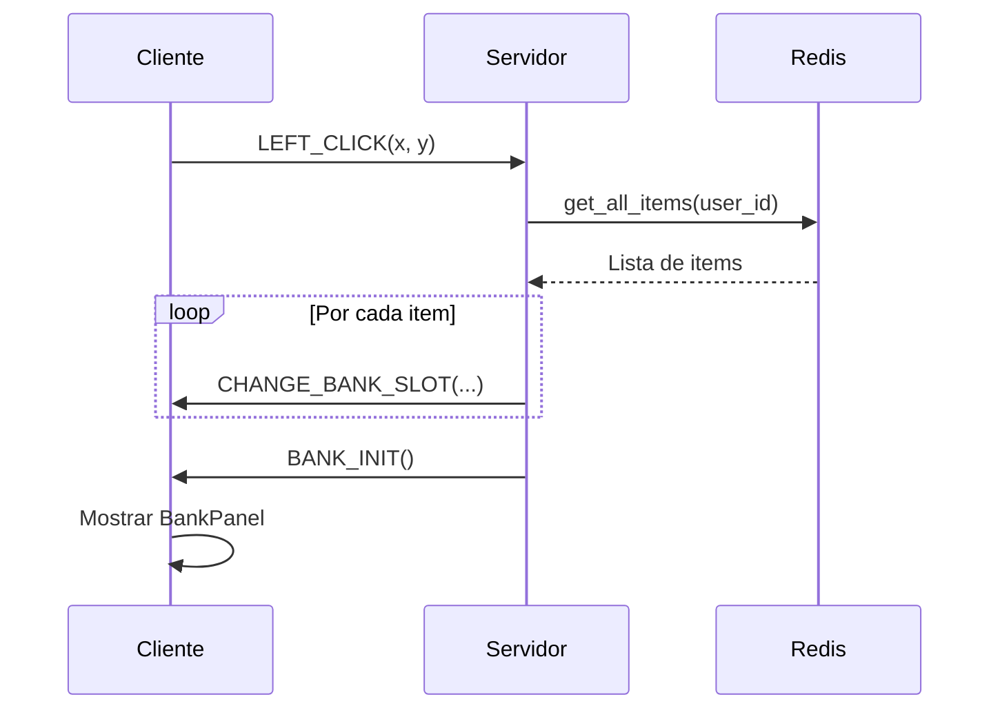
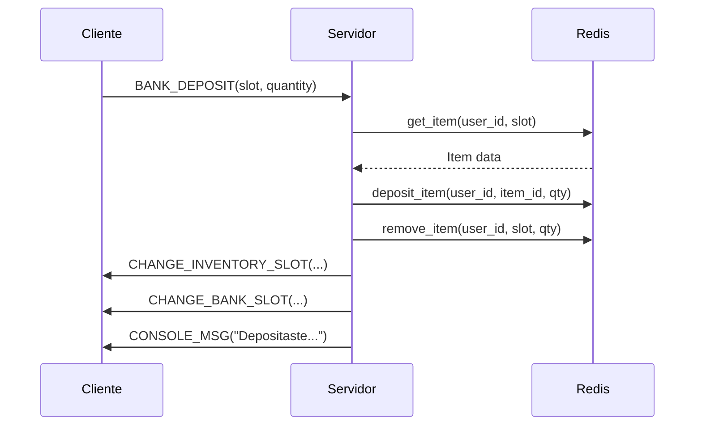
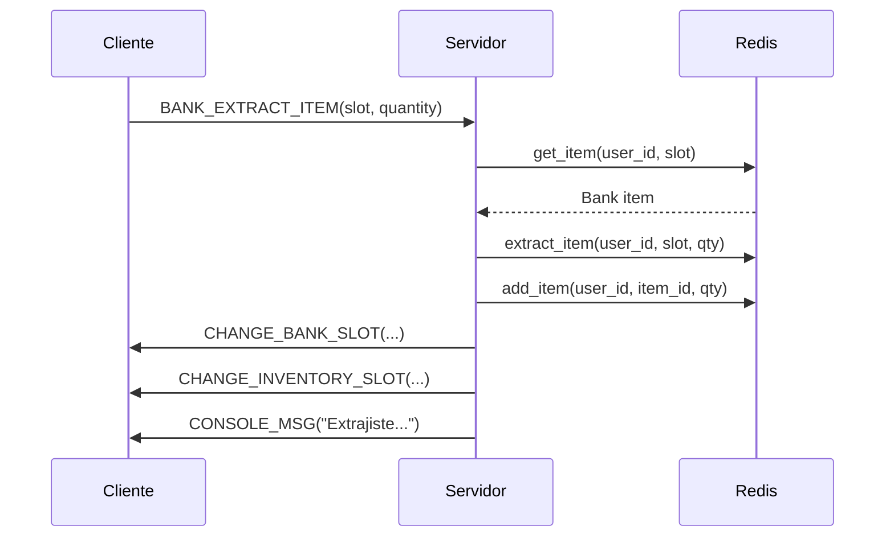

# Sistema de Banco

Sistema completo de bóveda bancaria para almacenar items de forma segura.

## 📋 Tabla de Contenidos

- [Características](#características)
- [Protocolo](#protocolo)
- [Arquitectura](#arquitectura)
- [Flujo de Operaciones](#flujo-de-operaciones)
- [Configuración](#configuración)
- [Validaciones](#validaciones)

## ✨ Características

- **Bóveda Personal:** Cada jugador tiene 20 slots de almacenamiento
- **Transacciones Atómicas:** Rollback automático en caso de error
- **Apilamiento Inteligente:** Items del mismo tipo se apilan automáticamente
- **Persistencia:** Datos guardados en Redis
- **Validaciones:** Cantidad, espacio disponible, existencia de items

## 📡 Protocolo

### Cliente → Servidor

#### LEFT_CLICK (26)
Abrir ventana de banco al hacer click en un banquero.

**Formato:**
```
PacketID (u8) + X (u8) + Y (u8)
```

#### BANK_DEPOSIT (43)
Depositar item del inventario al banco.

**Formato:**
```
PacketID (u8) + Slot (u8) + Quantity (u16)
```

**Ejemplo:**
```python
# Depositar 5 items del slot 3
packet = bytes([43, 3, 5, 0])  # 5 en little-endian
```

#### BANK_EXTRACT_ITEM (41)
Extraer item del banco al inventario.

**Formato:**
```
PacketID (u8) + Slot (u8) + Quantity (u16)
```

#### BANK_END (21)
Cerrar ventana de banco.

**Formato:**
```
PacketID (u8)
```

### Servidor → Cliente

#### BANK_INIT (8)
Abrir ventana de banco (packet vacío).

**Formato:**
```
PacketID (u8)
```

**Nota:** Los items se envían previamente con `CHANGE_BANK_SLOT`.

#### CHANGE_BANK_SLOT (48)
Actualizar un slot de la bóveda bancaria.

**Formato:**
```
PacketID (u8)
Slot (u8)
ItemID (u16)
Name (unicode string)
Amount (u16)
GrhID (u16)
ObjType (u8)
MaxHit (u16)
MinHit (u16)
MaxDef (u16)
MinDef (u16)
```

#### BANK_END (6)
Confirmar cierre de ventana.

**Formato:**
```
PacketID (u8)
```

#### CHANGE_INVENTORY_SLOT (47)
Actualizar slot de inventario después de depositar/extraer.

**Formato:** Ver `COMMERCE_SYSTEM.md`

#### CONSOLE_MSG (24)
Mensajes de error/confirmación.

## 🏗️ Arquitectura

### Componentes Principales

#### BankRepository (`src/bank_repository.py`)
Gestiona las bóvedas bancarias en Redis.

**Métodos principales:**
- `get_bank(user_id)` - Obtiene toda la bóveda
- `get_item(user_id, slot)` - Obtiene un item específico
- `get_all_items(user_id)` - Obtiene lista de items no vacíos
- `deposit_item(user_id, item_id, quantity)` - Deposita item
- `extract_item(user_id, slot, quantity)` - Extrae item

**Estructura de datos:**
```python
@dataclass
class BankItem:
    slot: int
    item_id: int
    quantity: int
```

#### TaskBankDeposit (`src/task_bank_deposit.py`)
Handler para depositar items en el banco.

**Validaciones:**
- Usuario logueado
- Cantidad válida (> 0)
- Item existe en inventario
- Cantidad suficiente
- Espacio en banco

**Flujo:**
1. Parsear packet (slot, quantity)
2. Validar cantidad
3. Obtener item del inventario
4. Depositar en banco
5. Remover del inventario
6. Enviar `CHANGE_INVENTORY_SLOT`
7. Enviar `CHANGE_BANK_SLOT`
8. Mensaje de confirmación

#### TaskBankExtract (`src/task_bank_extract.py`)
Handler para extraer items del banco.

**Validaciones:**
- Usuario logueado
- Cantidad válida (> 0)
- Item existe en banco
- Cantidad suficiente
- Espacio en inventario

**Flujo:**
1. Parsear packet (slot, quantity)
2. Validar cantidad
3. Obtener item del banco
4. Extraer del banco
5. Agregar al inventario
6. Enviar `CHANGE_BANK_SLOT`
7. Enviar `CHANGE_INVENTORY_SLOT`
8. Mensaje de confirmación

#### TaskLeftClick (`src/task_left_click.py`)
Detecta banqueros y abre la ventana.

**Método `_open_bank_window()`:**
1. Obtiene todos los items del banco
2. Envía `CHANGE_BANK_SLOT` por cada item
3. Envía `BANK_INIT` vacío

### Estructura Redis

```
bank:{user_id}:vault     # Hash con slots
  slot_1 = "item_id:quantity"
  slot_2 = "item_id:quantity"
  ...
  slot_20 = "item_id:quantity"
```

**Ejemplo:**
```
bank:123:vault
  slot_1 = "1:50"      # 50x Poción Roja
  slot_2 = "5:100"     # 100x Oro
  slot_3 = ""          # Vacío
  ...
```

## 🔄 Flujo de Operaciones

### Abrir Banco



### Depositar Item



### Extraer Item



## ⚙️ Configuración

### NPCs Banqueros

Configurar en `data/npcs_amigables.toml`:

```toml
[[npc]]
id = 5
nombre = "Banquero"
descripcion = "Gestiona tu banco personal de forma segura."
body_id = 504
head_id = 3
es_banquero = true
es_hostil = false
es_atacable = false
nivel = 0
hp_max = 0
oro_min = 0
oro_max = 0
respawn_time = 0
respawn_time_max = 0
```

### Spawn de Banqueros

Configurar en `data/map_npcs.toml`:

```toml
[[spawn]]
map_id = 1
npc_id = 5  # Banquero
x = 50
y = 44
heading = 3  # Sur
```

## ✅ Validaciones

### Depositar

- ✅ Usuario logueado
- ✅ Cantidad > 0
- ✅ Item existe en inventario
- ✅ Cantidad suficiente en inventario
- ✅ Espacio disponible en banco (20 slots)
- ✅ Apilamiento con items existentes

### Extraer

- ✅ Usuario logueado
- ✅ Cantidad > 0
- ✅ Item existe en banco
- ✅ Cantidad suficiente en banco
- ✅ Espacio disponible en inventario
- ✅ Rollback en caso de error

### Transacciones Atómicas

Si falla cualquier paso, se revierte la operación:

```python
# Ejemplo de rollback en extracción
success = await self.bank_repo.extract_item(user_id, slot, quantity)
modified_slots = await self.inventory_repo.add_item(user_id, item_id, quantity)

if not modified_slots:
    # Revertir extracción
    await self.bank_repo.deposit_item(user_id, item_id, quantity)
    await self.message_sender.send_console_msg("No tienes espacio")
    return
```

## 📊 Métricas

- **Cobertura de tests:** 45% global
- **Tests específicos:** 386 tests pasando
- **Capacidad:** 20 slots por jugador
- **Persistencia:** Redis

## 🔗 Ver También

- [Sistema de Comercio](COMMERCE_SYSTEM.md)
- [Sistema de Inventario](TODO_REFACTORING.md)
- [Protocolo de Red](../src/packet_id.py)
