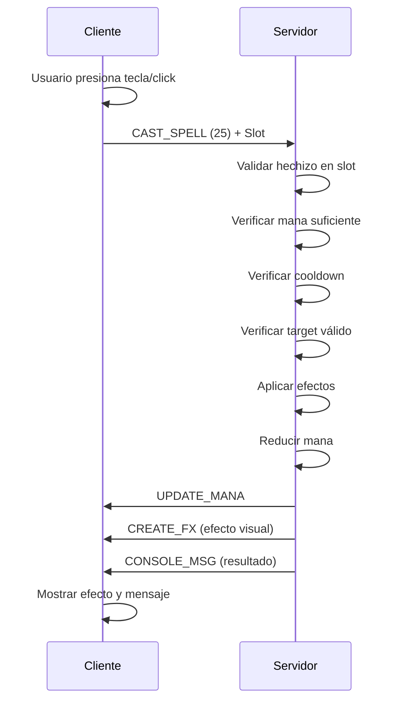
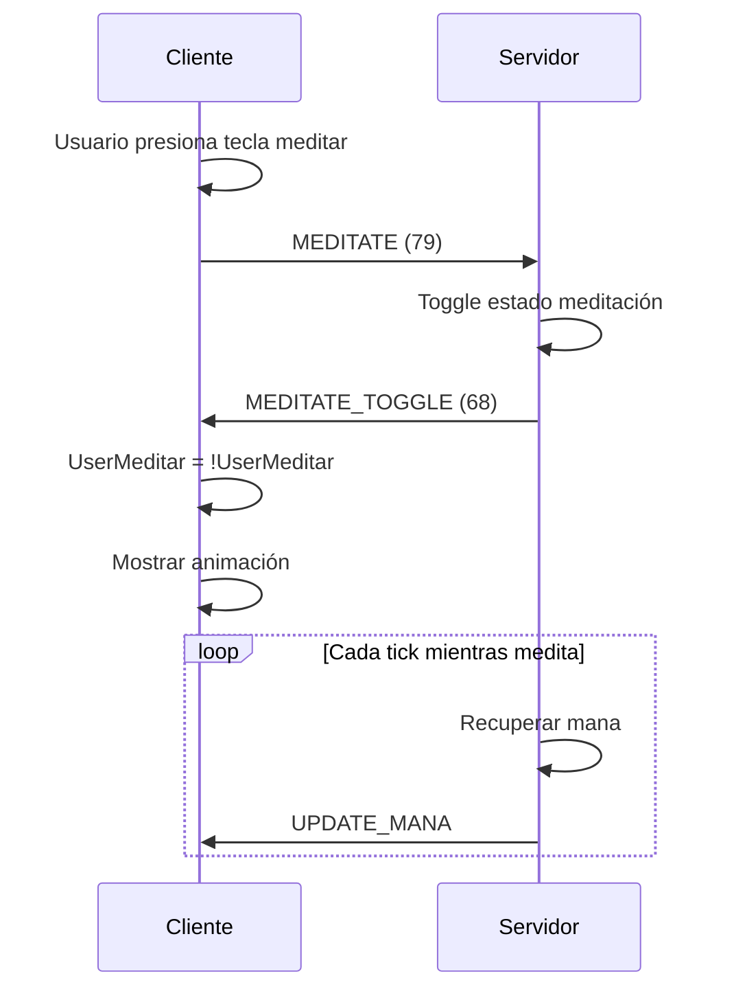

# Sistema de Magia - Argentum Online

> Documentación basada en el análisis del cliente VB6 0.13.3

**Versión:** 0.13.3  
**Fuente:** ArgentumOnline0.13.3-Cliente-Servidor  
**Fecha de análisis:** 2025-10-15

---

## Tabla de Contenidos

- [Protocolo de Comunicación](#protocolo-de-comunicación)
- [Estructura de Hechizos](#estructura-de-hechizos)
- [Sistema de Meditación](#sistema-de-meditación)
- [Timers e Intervalos](#timers-e-intervalos)
- [Flujos Completos](#flujos-completos)
- [NPCs y Hechizos](#npcs-y-hechizos)
- [Implementación Recomendada](#implementación-recomendada)
- [Ejemplo: Dardo Mágico](#ejemplo-dardo-mágico)

---

## Protocolo de Comunicación

### Paquetes del Cliente → Servidor

#### CAST_SPELL (25 / 0x19)
**Descripción:** Lanzar un hechizo desde el libro de hechizos

**Formato Antiguo (2 bytes):**
```
PacketID (1 byte) + Slot (1 byte)
```

**Formato Nuevo con Targeting (6 bytes):** ✅ IMPLEMENTADO
```
PacketID (1 byte) + Slot (1 byte) + TargetX (2 bytes) + TargetY (2 bytes)
```

**Ejemplos:**
```
0x19 0x01              # Lanza hechizo en slot 1 (sin target específico)
0x19 0x01 0x32 0x00 0x28 0x00  # Lanza en slot 1 hacia (50, 40)
```

**Notas:**
- El slot es la posición en el libro de hechizos (1-based)
- El cliente envía el slot, no el ID del hechizo
- El servidor debe validar que el jugador tenga ese hechizo
- **Targeting**: Si el packet tiene 6 bytes, incluye coordenadas del objetivo
- **Validación de rango**: Máximo 10 tiles (distancia Manhattan)
- **Compatibilidad**: Soporta ambos formatos (2 y 6 bytes)

---

#### MEDITATE (79 / 0x4F)
**Descripción:** Activar/desactivar meditación para recuperar mana

**Formato:**
```
PacketID (1 byte)
```

**Ejemplo:**
```
0x4F  # Toggle meditación
```

**Notas:**
- Es un toggle (activa/desactiva)
- El jugador debe estar quieto
- Se interrumpe al moverse o atacar

---

#### SPELL_INFO (35 / 0x23)
**Descripción:** Solicitar información de un hechizo

**Formato:**
```
PacketID (1 byte) + Slot (1 byte)
```

**Ejemplo:**
```
0x23 0x01  # Info del hechizo en slot 1
```

---

#### USE_SPELL_MACRO (29 / 0x1D)
**Descripción:** Usar macro de hechizo configurado

**Formato:**
```
PacketID (1 byte)
```

---

#### MOVE_SPELL (45 / 0x2D)
**Descripción:** Mover hechizo en el libro (reordenar)

**Formato:**
```
PacketID (1 byte) + Upwards (bool) + Slot (1 byte)
```

**Ejemplo:**
```
0x2D 0x01 0x03  # Mover hechizo del slot 3 hacia arriba
```

---

### Paquetes del Servidor → Cliente

#### CHANGE_SPELL_SLOT (14 / 0x0E)
**Descripción:** Actualizar un slot del libro de hechizos

**Formato:**
```
PacketID (1 byte) + Slot (1 byte) + SpellID (2 bytes) + Name (string)
```

**Cuándo se envía:**
- Cuando el jugador aprende un hechizo nuevo
- Al cargar el personaje (enviar todos los hechizos)
- SpellID es el ID del hechizo en Hechizos.dat

---

#### MEDITATE_TOGGLE (68 / 0x44)
**Descripción:** Confirmar activación/desactivación de meditación

**Formato:**
```
PacketID (1 byte)
```

**Efecto en el cliente:**
- El cliente cambia `UserMeditar = Not UserMeditar`
- Debe mostrar animación de meditación

---

#### UPDATE_MANA (16 / 0x10)
**Descripción:** Actualizar mana del jugador

**Formato:**
```
PacketID (1 byte) + MinMana (2 bytes) + MaxMana (2 bytes)
```

**Cuándo se envía:**
- Después de lanzar hechizos
- Durante la meditación (recuperación)
- Al subir de nivel

---

## Estructura de Hechizos

### Archivo Hechizos.dat

Los hechizos se definen en `server/Dat/Hechizos.dat` con el siguiente formato:

```ini
[HECHIZO1]
Nombre=Antídoto Mágico
Desc=Con este conjuro podrás mutar los fluidos tóxicos...
PalabrasMagicas=NIHIL VED
HechizeroMsg=Le has detenido el envenenamiento a 
PropioMsg=Te has detenido el envenenamiento.
TargetMsg=te ha detenido el envenenamiento.
Tipo=2
WAV=16
FXgrh=2
Loops=2
MinSkill=10
ManaRequerido=12
StaRequerido=1
Target=1
SubeHP=0
MinHP=0
MaxHP=0
SubeMana=0
MinMana=0
MaxMana=0
```

### Campos de un Hechizo

| Campo | Tipo | Descripción |
|-------|------|-------------|
| `Nombre` | string | Nombre del hechizo |
| `Desc` | string | Descripción del hechizo |
| `PalabrasMagicas` | string | Palabras mágicas para lanzar |
| `HechizeroMsg` | string | Mensaje que ve el caster |
| `PropioMsg` | string | Mensaje que ve el target si es el mismo |
| `TargetMsg` | string | Mensaje que ve el target |
| `Tipo` | int | Tipo de hechizo (ver tabla) |
| `WAV` | int | ID del sonido |
| `FXgrh` | int | ID del gráfico de efecto |
| `Loops` | int | Cantidad de loops del efecto |
| `MinSkill` | int | Skill mínimo requerido |
| `ManaRequerido` | int | Mana que consume |
| `StaRequerido` | int | Stamina que consume |
| `Target` | int | Tipo de objetivo (ver tabla) |
| `SubeHP` | bool | Si afecta HP |
| `MinHP` | int | HP mínimo que afecta |
| `MaxHP` | int | HP máximo que afecta |
| `SubeMana` | bool | Si afecta Mana |
| `SubeSta` | bool | Si afecta Stamina |

### Tipos de Hechizos

| Tipo | Descripción |
|------|-------------|
| 1 | Actúan sobre HP, MANA, STA, HAM y SED |
| 2 | Actúan sobre los estados de los usuarios |
| 3 | Invocación |
| 4 | Materializa |
| 5 | Metamorfosis |

### Tipos de Objetivos (Target)

| Target | Descripción |
|--------|-------------|
| 1 | Usuario (self) |
| 2 | NPC |
| 3 | Usuario Y NPC |
| 4 | Terreno |

---

## Sistema de Meditación

### Mecánicas

- **Activación:** Enviar packet `MEDITATE (79)`
- **Tipo:** Toggle (on/off)
- **Requisitos:** El jugador debe estar quieto
- **Efecto:** Recupera mana gradualmente

### Interrupciones

La meditación se interrumpe cuando:
- El jugador se mueve
- El jugador ataca
- El jugador lanza un hechizo
- El jugador recibe daño

### Recuperación de Mana

La cantidad de mana recuperada por tick depende de:
- **Skill de Meditación** del jugador
- **Inteligencia**
- **Clase** (magos recuperan más)

---

## Timers e Intervalos

### IntervaloPermiteLanzarSpell

**Descripción:** Tiempo mínimo entre lanzamientos de hechizos

**Valor por defecto:** ~1400ms (1.4 segundos)

**Variable:** `UserList(UserIndex).Counters.TimerLanzarSpell`

**Propósito:** Prevenir spam de hechizos

---

### IntervaloMagiaGolpe

**Descripción:** Intervalo entre magia y golpe físico

**Propósito:** Prevenir atacar inmediatamente después de lanzar hechizo

**Función:** `IntervaloPermiteMagiaGolpe(UserIndex)`

---

### IntervaloGolpeMagia

**Descripción:** Intervalo entre golpe físico y magia

**Propósito:** Prevenir lanzar hechizo inmediatamente después de atacar

**Función:** `IntervaloPermiteGolpeMagia(UserIndex)`

---

## Flujos Completos

### Flujo: Lanzar Hechizo



**Pasos detallados:**

1. **Cliente:** Usuario presiona tecla o hace click en hechizo
2. **Cliente:** Envía `WriteCastSpell(slot)` → Packet `CAST_SPELL (25) + Slot (1 byte)`
3. **Servidor:** Valida que el jugador tenga el hechizo en ese slot
4. **Servidor:** Verifica mana suficiente
5. **Servidor:** Verifica intervalo de casteo (`IntervaloPermiteLanzarSpell`)
6. **Servidor:** Verifica target válido
7. **Servidor:** Aplica efectos del hechizo
8. **Servidor:** Reduce mana del jugador
9. **Servidor:** Envía `UPDATE_MANA` al cliente
10. **Servidor:** Envía `CREATE_FX` para efecto visual
11. **Servidor:** Envía `CONSOLE_MSG` con resultado
12. **Cliente:** Muestra efecto visual y mensaje

---

### Flujo: Meditación



**Pasos detallados:**

1. **Cliente:** Usuario presiona tecla de meditar
2. **Cliente:** Envía `WriteMeditate()` → Packet `MEDITATE (79)`
3. **Servidor:** Toggle estado de meditación
4. **Servidor:** Envía `MEDITATE_TOGGLE` al cliente
5. **Cliente:** Actualiza `UserMeditar = Not UserMeditar`
6. **Cliente:** Muestra/oculta animación de meditación
7. **Servidor:** En cada tick, si está meditando, recupera mana
8. **Servidor:** Envía `UPDATE_MANA` con nuevo valor

---

## NPCs y Hechizos

### Configuración en NPCs.dat

Los NPCs pueden lanzar hechizos si están configurados:

```ini
[NPC1]
Name=Mago Oscuro
LanzaSpells=3
Sp1=5
Sp2=12
Sp3=18
```

**Campos:**
- `LanzaSpells`: Cantidad de hechizos que puede lanzar
- `Sp1`, `Sp2`, etc.: IDs de los hechizos

### IA de NPCs con Hechizos

**Función:** `NpcLanzaUnSpell(NpcIndex, UserIndex)`

**Condiciones para lanzar:**
- El NPC tiene `LanzaSpells > 0`
- El target está en rango
- El target no está protegido (admin invisible, consulta, etc.)

---

## Implementación Recomendada

### Archivos a Crear

#### 1. `data/spells.toml`
Catálogo de hechizos (equivalente a Hechizos.dat)

```toml
[[spell]]
id = 1
name = "Dardo Mágico"
description = "Lanza un proyectil mágico que causa daño"
magic_words = "SAGITTA"
type = 1  # Daño
target = 3  # Usuario y NPC
mana_cost = 5
stamina_cost = 0
min_skill = 1
wav = 10
fx_grh = 5
loops = 1
min_damage = 5
max_damage = 15
```

---

#### 2. `src/spell_catalog.py`
Cargar y gestionar catálogo de hechizos

**Responsabilidades:**
- Cargar `spells.toml`
- Obtener hechizo por ID
- Validar existencia

---

#### 3. `src/spell_service.py`
Lógica de negocio de hechizos

**Responsabilidades:**
- Calcular daño de hechizos
- Aplicar efectos
- Validar targets
- Gestionar cooldowns

---

#### 4. `src/task_cast_spell.py`
Handler para lanzar hechizos

**Responsabilidades:**
- Parsear packet `CAST_SPELL`
- Validar que el jugador tenga el hechizo
- Verificar mana suficiente
- Verificar cooldown
- Aplicar efectos
- Enviar `UPDATE_MANA`
- Enviar `CREATE_FX`

---

#### 5. `src/task_meditate.py`
Handler para meditación

**Responsabilidades:**
- Toggle estado de meditación
- Enviar `MEDITATE_TOGGLE`
- Validar que el jugador esté quieto

---

#### 6. `src/meditation_effect.py`
Efecto de meditación para GameTick

**Responsabilidades:**
- Recuperar mana cada tick
- Verificar que el jugador siga meditando
- Enviar `UPDATE_MANA`

---

## Ejemplo: Dardo Mágico

### Configuración del Hechizo

```toml
[[spell]]
id = 3
name = "Dardo Mágico"
description = "Lanza un proyectil mágico que causa daño"
magic_words = "SAGITTA"
type = 1  # Daño a HP
target = 3  # Usuario y NPC
mana_cost = 5
stamina_cost = 0
min_skill = 1
min_damage = 5
max_damage = 15
wav = 10
fx_grh = 5
loops = 1
```

### Uso en el Juego

**Acción del cliente:**
- Presionar tecla o click en slot del hechizo

**Validaciones del servidor:**
1. Verificar que el jugador tenga >= 5 mana
2. Verificar cooldown de 1.4 segundos
3. Verificar que haya un target válido (NPC o jugador)

**Efectos del servidor:**
1. Reducir 5 mana del jugador
2. Calcular daño: `random(5, 15) + bonus_inteligencia`
3. Aplicar daño al target
4. Enviar `UPDATE_MANA` al jugador
5. Enviar `CREATE_FX` en posición del target
6. Enviar `CONSOLE_MSG` con resultado

**Mensajes:**
- Caster: "Has lanzado Dardo Mágico sobre [Target]"
- Target: "[Caster] te ha lanzado Dardo Mágico. Daño: 12"

---

## Notas Adicionales

### Encoding
Los archivos `.dat` del servidor original usan **ISO-8859-1 (Latin-1)**

### Cliente Original
El cliente original está en **Visual Basic 6**

### Compatibilidad
Mantener compatibilidad con el cliente VB6 original (versión 0.13.3)

### Consideraciones Importantes

⚠️ **Slots de hechizos:** Son 1-based, no 0-based  
⚠️ **CharIndex:** Los hechizos usan CharIndex para identificar targets  
⚠️ **Cooldowns:** Son críticos para el balance del juego  
⚠️ **Meditación:** Es la forma principal de recuperar mana  

---

## Variables del Cliente VB6

### UserHechizos()
**Tipo:** Array  
**Descripción:** Array de IDs de hechizos que tiene el jugador  
**Actualización:** Se actualiza con `HandleChangeSpellSlot`

### UserMeditar
**Tipo:** Boolean  
**Descripción:** Estado de meditación del jugador  
**Actualización:** Se actualiza con `HandleMeditateToggle`

---

**Última actualización:** 2025-10-15  
**Autor:** Análisis del código fuente de Argentum Online 0.13.3
