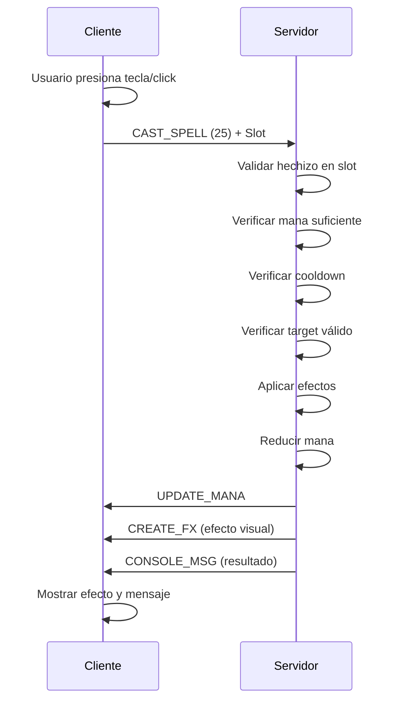
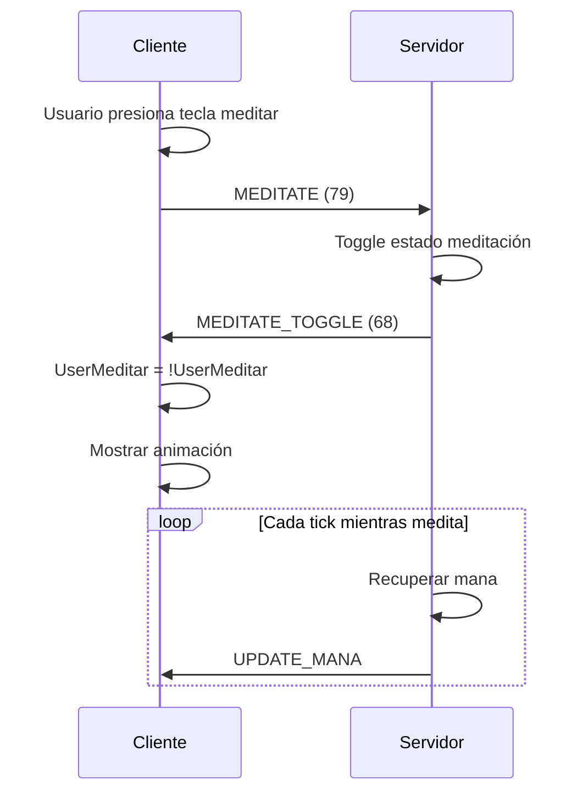

> **Última consolidación:** 2026-05

# Sistema de Magia - Argentum Online

> Documentación basada en el análisis del cliente VB6 0.13.3

**Versión:** 0.13.3  
**Fuente:** ArgentumOnline0.13.3-Cliente-Servidor  
**Fecha de análisis:** 2025-10-15

---

## Tabla de Contenidos

- [Protocolo de Comunicación](#protocolo-de-comunicación)
- [Estructura de Hechizos](#estructura-de-hechizos)
- [Sistema de Meditación](#sistema-de-meditación)
- [Timers e Intervalos](#timers-e-intervalos)
- [Flujos Completos](#flujos-completos)
- [NPCs y Hechizos](#npcs-y-hechizos)
- [Implementación Recomendada](#implementación-recomendada)
- [Ejemplo: Dardo Mágico](#ejemplo-dardo-mágico)

---

## Protocolo de Comunicación

### Paquetes del Cliente → Servidor

#### CAST_SPELL (25 / 0x19)
**Descripción:** Lanzar un hechizo desde el libro de hechizos

**Formato Antiguo (2 bytes):**
```
PacketID (1 byte) + Slot (1 byte)
```

**Formato Nuevo con Targeting (6 bytes):** ✅ IMPLEMENTADO
```
PacketID (1 byte) + Slot (1 byte) + TargetX (2 bytes) + TargetY (2 bytes)
```

**Ejemplos:**
```
0x19 0x01              # Lanza hechizo en slot 1 (sin target específico)
0x19 0x01 0x32 0x00 0x28 0x00  # Lanza en slot 1 hacia (50, 40)
```

**Notas:**
- El slot es la posición en el libro de hechizos (1-based)
- El cliente envía el slot, no el ID del hechizo
- El servidor debe validar que el jugador tenga ese hechizo
- **Targeting**: Si el packet tiene 6 bytes, incluye coordenadas del objetivo
- **Validación de rango**: Máximo 10 tiles (distancia Manhattan)
- **Compatibilidad**: Soporta ambos formatos (2 y 6 bytes)

---

#### MEDITATE (79 / 0x4F)
**Descripción:** Activar/desactivar meditación para recuperar mana

**Formato:**
```
PacketID (1 byte)
```

**Ejemplo:**
```
0x4F  # Toggle meditación
```

**Notas:**
- Es un toggle (activa/desactiva)
- El jugador debe estar quieto
- Se interrumpe al moverse o atacar

---

#### SPELL_INFO (35 / 0x23)
**Descripción:** Solicitar información de un hechizo

**Formato:**
```
PacketID (1 byte) + Slot (1 byte)
```

**Ejemplo:**
```
0x23 0x01  # Info del hechizo en slot 1
```

**Implementación (Servidor Python):** ✅
- Handler: `TaskSpellInfo`
- Dependencias: `SpellbookRepository`, `SpellCatalog`
- Respuesta: `ConsoleMsg` multilínea con nombre, descripción, skill requerido, maná y energía
- Validación previa: `validator.validate_packet_by_id(ClientPacketID.SPELL_INFO)`

---

#### USE_SPELL_MACRO (29 / 0x1D)
**Descripción:** Usar macro de hechizo configurado

**Formato:**
```
PacketID (1 byte)
```

---

#### MOVE_SPELL (45 / 0x2D)
**Descripción:** Mover hechizo en el libro (reordenar)

**Formato:**
```
PacketID (1 byte) + Upwards (bool) + Slot (1 byte)
```

**Ejemplo:**
```
0x2D 0x01 0x03  # Mover hechizo del slot 3 hacia arriba
```

---

### Paquetes del Servidor → Cliente

#### CHANGE_SPELL_SLOT (14 / 0x0E)
**Descripción:** Actualizar un slot del libro de hechizos

**Formato:**
```
PacketID (1 byte) + Slot (1 byte) + SpellID (2 bytes) + Name (string)
```

**Cuándo se envía:**
- Cuando el jugador aprende un hechizo nuevo
- Al cargar el personaje (enviar todos los hechizos)
- SpellID es el ID del hechizo en Hechizos.dat

---

#### MEDITATE_TOGGLE (68 / 0x44)
**Descripción:** Confirmar activación/desactivación de meditación

**Formato:**
```
PacketID (1 byte)
```

**Efecto en el cliente:**
- El cliente cambia `UserMeditar = Not UserMeditar`
- Debe mostrar animación de meditación

---

#### UPDATE_MANA (16 / 0x10)
**Descripción:** Actualizar mana del jugador

**Formato:**
```
PacketID (1 byte) + MinMana (2 bytes) + MaxMana (2 bytes)
```

**Cuándo se envía:**
- Después de lanzar hechizos
- Durante la meditación (recuperación)
- Al subir de nivel

---

## Estructura de Hechizos

### Archivo Hechizos.dat

Los hechizos se definen en `server/Dat/Hechizos.dat` con el siguiente formato:

```ini
[HECHIZO1]
Nombre=Antídoto Mágico
Desc=Con este conjuro podrás mutar los fluidos tóxicos...
PalabrasMagicas=NIHIL VED
HechizeroMsg=Le has detenido el envenenamiento a 
PropioMsg=Te has detenido el envenenamiento.
TargetMsg=te ha detenido el envenenamiento.
Tipo=2
WAV=16
FXgrh=2
Loops=2
MinSkill=10
ManaRequerido=12
StaRequerido=1
Target=1
SubeHP=0
MinHP=0
MaxHP=0
SubeMana=0
MinMana=0
MaxMana=0
```

### Campos de un Hechizo

| Campo | Tipo | Descripción |
|-------|------|-------------|
| `Nombre` | string | Nombre del hechizo |
| `Desc` | string | Descripción del hechizo |
| `PalabrasMagicas` | string | Palabras mágicas para lanzar |
| `HechizeroMsg` | string | Mensaje que ve el caster |
| `PropioMsg` | string | Mensaje que ve el target si es el mismo |
| `TargetMsg` | string | Mensaje que ve el target |
| `Tipo` | int | Tipo de hechizo (ver tabla) |
| `WAV` | int | ID del sonido |
| `FXgrh` | int | ID del gráfico de efecto |
| `Loops` | int | Cantidad de loops del efecto |
| `MinSkill` | int | Skill mínimo requerido |
| `ManaRequerido` | int | Mana que consume |
| `StaRequerido` | int | Stamina que consume |
| `Target` | int | Tipo de objetivo (ver tabla) |
| `SubeHP` | bool | Si afecta HP |
| `MinHP` | int | HP mínimo que afecta |
| `MaxHP` | int | HP máximo que afecta |
| `SubeMana` | bool | Si afecta Mana |
| `SubeSta` | bool | Si afecta Stamina |

### Tipos de Hechizos

| Tipo | Descripción |
|------|-------------|
| 1 | Actúan sobre HP, MANA, STA, HAM y SED |
| 2 | Actúan sobre los estados de los usuarios |
| 3 | Invocación |
| 4 | Materializa |
| 5 | Metamorfosis |

### Tipos de Objetivos (Target)

| Target | Descripción |
|--------|-------------|
| 1 | Usuario (self) |
| 2 | NPC |
| 3 | Usuario Y NPC |
| 4 | Terreno |

---

## Sistema de Meditación

### Mecánicas

- **Activación:** Enviar packet `MEDITATE (79)`
- **Tipo:** Toggle (on/off)
- **Requisitos:** El jugador debe estar quieto
- **Efecto:** Recupera mana gradualmente

### Interrupciones

La meditación se interrumpe cuando:
- El jugador se mueve
- El jugador ataca
- El jugador lanza un hechizo
- El jugador recibe daño

### Recuperación de Mana

La cantidad de mana recuperada por tick depende de:
- **Skill de Meditación** del jugador
- **Inteligencia**
- **Clase** (magos recuperan más)

---

## Timers e Intervalos

### IntervaloPermiteLanzarSpell

**Descripción:** Tiempo mínimo entre lanzamientos de hechizos

**Valor por defecto:** ~1400ms (1.4 segundos)

**Variable:** `UserList(UserIndex).Counters.TimerLanzarSpell`

**Propósito:** Prevenir spam de hechizos

---

### IntervaloMagiaGolpe

**Descripción:** Intervalo entre magia y golpe físico

**Propósito:** Prevenir atacar inmediatamente después de lanzar hechizo

**Función:** `IntervaloPermiteMagiaGolpe(UserIndex)`

---

### IntervaloGolpeMagia

**Descripción:** Intervalo entre golpe físico y magia

**Propósito:** Prevenir lanzar hechizo inmediatamente después de atacar

**Función:** `IntervaloPermiteGolpeMagia(UserIndex)`

---

## Flujos Completos

### Flujo: Lanzar Hechizo



**Pasos detallados:**

1. **Cliente:** Usuario presiona tecla o hace click en hechizo
2. **Cliente:** Envía `WriteCastSpell(slot)` → Packet `CAST_SPELL (25) + Slot (1 byte)`
3. **Servidor:** Valida que el jugador tenga el hechizo en ese slot
4. **Servidor:** Verifica mana suficiente
5. **Servidor:** Verifica intervalo de casteo (`IntervaloPermiteLanzarSpell`)
6. **Servidor:** Verifica target válido
7. **Servidor:** Aplica efectos del hechizo
8. **Servidor:** Reduce mana del jugador
9. **Servidor:** Envía `UPDATE_MANA` al cliente
10. **Servidor:** Envía `CREATE_FX` para efecto visual
11. **Servidor:** Envía `CONSOLE_MSG` con resultado
12. **Cliente:** Muestra efecto visual y mensaje

---

### Flujo: Meditación



**Pasos detallados:**

1. **Cliente:** Usuario presiona tecla de meditar
2. **Cliente:** Envía `WriteMeditate()` → Packet `MEDITATE (79)`
3. **Servidor:** Toggle estado de meditación
4. **Servidor:** Envía `MEDITATE_TOGGLE` al cliente
5. **Cliente:** Actualiza `UserMeditar = Not UserMeditar`
6. **Cliente:** Muestra/oculta animación de meditación
7. **Servidor:** En cada tick, si está meditando, recupera mana
8. **Servidor:** Envía `UPDATE_MANA` con nuevo valor

---

## NPCs y Hechizos

### Configuración en NPCs.dat

Los NPCs pueden lanzar hechizos si están configurados:

```ini
[NPC1]
Name=Mago Oscuro
LanzaSpells=3
Sp1=5
Sp2=12
Sp3=18
```

**Campos:**
- `LanzaSpells`: Cantidad de hechizos que puede lanzar
- `Sp1`, `Sp2`, etc.: IDs de los hechizos

### IA de NPCs con Hechizos

**Función:** `NpcLanzaUnSpell(NpcIndex, UserIndex)`

**Condiciones para lanzar:**
- El NPC tiene `LanzaSpells > 0`
- El target está en rango
- El target no está protegido (admin invisible, consulta, etc.)

---

## Implementación Recomendada

### Archivos a Crear

#### 1. `data/spells.toml`
Catálogo de hechizos (equivalente a Hechizos.dat)

```toml
[[spell]]
id = 1
name = "Dardo Mágico"
description = "Lanza un proyectil mágico que causa daño"
magic_words = "SAGITTA"
type = 1  # Daño
target = 3  # Usuario y NPC
mana_cost = 5
stamina_cost = 0
min_skill = 1
wav = 10
fx_grh = 5
loops = 1
min_damage = 5
max_damage = 15
```

---

#### 2. `src/spell_catalog.py`
Cargar y gestionar catálogo de hechizos

**Responsabilidades:**
- Cargar `spells.toml`
- Obtener hechizo por ID
- Validar existencia

---

#### 3. `src/spell_service.py`
Lógica de negocio de hechizos

**Responsabilidades:**
- Calcular daño de hechizos
- Aplicar efectos
- Validar targets
- Gestionar cooldowns

---

#### 4. `src/task_cast_spell.py`
Handler para lanzar hechizos

**Responsabilidades:**
- Parsear packet `CAST_SPELL`
- Validar que el jugador tenga el hechizo
- Verificar mana suficiente
- Verificar cooldown
- Aplicar efectos
- Enviar `UPDATE_MANA`
- Enviar `CREATE_FX`

---

#### 5. `src/task_meditate.py`
Handler para meditación

**Responsabilidades:**
- Toggle estado de meditación
- Enviar `MEDITATE_TOGGLE`
- Validar que el jugador esté quieto

---

#### 6. `src/meditation_effect.py`
Efecto de meditación para GameTick

**Responsabilidades:**
- Recuperar mana cada tick
- Verificar que el jugador siga meditando
- Enviar `UPDATE_MANA`

---

## Ejemplo: Dardo Mágico

### Configuración del Hechizo

```toml
[[spell]]
id = 3
name = "Dardo Mágico"
description = "Lanza un proyectil mágico que causa daño"
magic_words = "SAGITTA"
type = 1  # Daño a HP
target = 3  # Usuario y NPC
mana_cost = 5
stamina_cost = 0
min_skill = 1
min_damage = 5
max_damage = 15
wav = 10
fx_grh = 5
loops = 1
```

### Uso en el Juego

**Acción del cliente:**
- Presionar tecla o click en slot del hechizo

**Validaciones del servidor:**
1. Verificar que el jugador tenga >= 5 mana
2. Verificar cooldown de 1.4 segundos
3. Verificar que haya un target válido (NPC o jugador)

**Efectos del servidor:**
1. Reducir 5 mana del jugador
2. Calcular daño: `random(5, 15) + bonus_inteligencia`
3. Aplicar daño al target
4. Enviar `UPDATE_MANA` al jugador
5. Enviar `CREATE_FX` en posición del target
6. Enviar `CONSOLE_MSG` con resultado

**Mensajes:**
- Caster: "Has lanzado Dardo Mágico sobre [Target]"
- Target: "[Caster] te ha lanzado Dardo Mágico. Daño: 12"

---

## Notas Adicionales

### Encoding
Los archivos `.dat` del servidor original usan **ISO-8859-1 (Latin-1)**

### Cliente Original
El cliente original está en **Visual Basic 6**

### Compatibilidad
Mantener compatibilidad con el cliente VB6 original (versión 0.13.3)

### Consideraciones Importantes

⚠️ **Slots de hechizos:** Son 1-based, no 0-based  
⚠️ **CharIndex:** Los hechizos usan CharIndex para identificar targets  
⚠️ **Cooldowns:** Son críticos para el balance del juego  
⚠️ **Meditación:** Es la forma principal de recuperar mana  

---

## Variables del Cliente VB6

### UserHechizos()
**Tipo:** Array  
**Descripción:** Array de IDs de hechizos que tiene el jugador  
**Actualización:** Se actualiza con `HandleChangeSpellSlot`

### UserMeditar
**Tipo:** Boolean  
**Descripción:** Estado de meditación del jugador  
**Actualización:** Se actualiza con `HandleMeditateToggle`

---

**Última actualización:** 2025-10-15  
**Autor:** Análisis del código fuente de Argentum Online 0.13.3

---

## Planificación avanzada: SPELL_ADVANCED_IMPLEMENTATION_PLAN.md

> Documento fuente archivado en [`archive/superseded/SPELL_ADVANCED_IMPLEMENTATION_PLAN.md`](../archive/superseded/SPELL_ADVANCED_IMPLEMENTATION_PLAN.md).

**Fecha:** 2025-01-31  
**Versión Objetivo:** v0.11.0-alpha  
**Estado:** 📋 Planificación

---

## 📊 Análisis del Estado Actual

### ✅ Lo que ya está implementado:

1. **Sistema básico de hechizos:**
   - 11 hechizos básicos (de 46 totales)
   - Casteo de hechizos (daño directo)
   - Validación de mana/stamina
   - Efectos visuales (FX)
   - Paralización de NPCs (básico)

2. **Tipos de hechizos soportados:**
   - Tipo 1: Daño/Curar HP básico
   - Tipo 2: Estados básicos (paralización)

### ❌ Lo que falta implementar:

1. **Efectos de estado faltantes:**
   - ❌ Envenenamiento (Envenena=1)
   - ❌ Inmovilización (Inmoviliza=1)
   - ❌ Ceguera (Ceguera=1)
   - ❌ Estupidez (Estupidez=1)
   - ❌ Remover estados (RemoverParalisis, RemoverEstupidez)
   - ❌ Invisibilidad (Invisibilidad=1)
   - ❌ Remover invisibilidad parcial

2. **Tipos de hechizos faltantes:**
   - ❌ Tipo 3: Invocación (Invoca=1)
   - ❌ Tipo 4: Materialización (Materializa=1)
   - ❌ Tipo 5: Metamorfosis (Mimetiza=1)

3. **Funcionalidades avanzadas:**
   - ❌ Hechizos de área (AOE)
   - ❌ Hechizos sobre terreno (Target=4)
   - ❌ Curación sobre otros jugadores
   - ❌ Resucitación (Revivir=1)
   - ❌ Sistema de runas y componentes
   - ❌ Escuelas de magia (Fuego, Agua, Tierra, Aire, etc.)

4. **Hechizos faltantes:**
   - Solo 11/46 hechizos implementados
   - Faltan 35 hechizos por importar

---

## 📋 Plan de Implementación por Fases

### Fase 1: Importar Todos los Hechizos (Prioridad Alta) ✅ COMPLETADO

**Objetivo:** Tener todos los 46 hechizos del VB6 en el servidor.

**Tareas:**
1. ✅ Crear script para extraer todos los hechizos de `Hechizos.dat`
2. ✅ Convertir a formato TOML
3. ✅ Agregar a `data/spells.toml`
4. ✅ Verificar que el catálogo los carga correctamente

**Archivos creados/modificados:**
- ✅ `tools/extraction/extract_all_spells.py` - Script de extracción
- ✅ `data/spells.toml` - Expandido de 11 a 46 hechizos (908 líneas)

**Resultados:**
- ✅ 46/46 hechizos importados correctamente
- ✅ Sin duplicados
- ✅ Todos los campos mapeados correctamente
- ✅ Efectos especiales identificados (envenenamiento, paralización, invocación, etc.)

**Criterio de éxito:** ✅ 46 hechizos cargados en el servidor.

---

### Fase 2: Efectos de Estado Completos (Prioridad Alta)

**Objetivo:** Implementar todos los efectos de estado del VB6.

#### 2.1 Envenenamiento

**Campos del hechizo:**
- `Envenena=1` - Activa envenenamiento

**Implementación:**
1. Agregar campo `poisoned_until: float` a modelo `Player`
2. Agregar método `update_player_poisoned_until()` en `PlayerRepository`
3. Crear efecto periódico `PoisonEffect` que reduzca HP cada tick
4. Aplicar envenenamiento en `SpellService` cuando `Envenena=1`
5. Chequear envenenamiento en `NPCAIService` para prevenir ataques (opcional)

**Archivos a crear/modificar:**
- `src/models/player.py` - Agregar campo
- `src/repositories/player_repository.py` - Método de actualización
- `src/effects/poison_effect.py` - Efecto periódico
- `src/services/player/spell_service.py` - Aplicar envenenamiento

---

#### 2.2 Inmovilización

**Campos del hechizo:**
- `Inmoviliza=1` - Activa inmovilización

**Implementación:**
1. Agregar campo `immobilized_until: float` a modelo `Player`
2. Agregar método `update_player_immobilized_until()` en `PlayerRepository`
3. Chequear inmovilización en `TaskWalk` para prevenir movimiento
4. Aplicar inmovilización en `SpellService` cuando `Inmoviliza=1`

**Archivos a crear/modificar:**
- `src/models/player.py` - Agregar campo
- `src/repositories/player_repository.py` - Método de actualización
- `src/tasks/player/task_walk.py` - Chequear antes de mover
- `src/services/player/spell_service.py` - Aplicar inmovilización

---

#### 2.3 Ceguera

**Campos del hechizo:**
- `Ceguera=1` - Activa ceguera

**Implementación:**
1. Agregar campo `blinded_until: float` a modelo `Player`
2. Agregar método `update_player_blinded_until()` en `PlayerRepository`
3. Efecto: Reducir rango de visión (opcional, puede ser solo visual)
4. Aplicar ceguera en `SpellService` cuando `Ceguera=1`

**Archivos a crear/modificar:**
- `src/models/player.py` - Agregar campo
- `src/repositories/player_repository.py` - Método de actualización
- `src/services/player/spell_service.py` - Aplicar ceguera

---

#### 2.4 Estupidez

**Campos del hechizo:**
- `Estupidez=1` - Activa estupidez

**Implementación:**
1. Agregar campo `dumb_until: float` a modelo `Player`
2. Agregar método `update_player_dumb_until()` en `PlayerRepository`
3. Efecto: Prevenir lanzar hechizos (chequear en `TaskCastSpell`)
4. Aplicar estupidez en `SpellService` cuando `Estupidez=1`

**Archivos a crear/modificar:**
- `src/models/player.py` - Agregar campo
- `src/repositories/player_repository.py` - Método de actualización
- `src/tasks/spells/task_cast_spell.py` - Chequear antes de lanzar
- `src/services/player/spell_service.py` - Aplicar estupidez

---

#### 2.5 Remover Estados

**Campos del hechizo:**
- `RemoverParalisis=1`
- `RemoverEstupidez=1`
- `CuraVeneno=1` (ya existe básico, mejorar)

**Implementación:**
1. Métodos helper en `SpellService` para remover cada estado
2. Llamarlos cuando el hechizo correspondiente se lance
3. Actualizar flags en Redis

**Archivos a modificar:**
- `src/services/player/spell_service.py` - Métodos para remover estados

---

### Fase 3: Curación sobre Otros Jugadores (Prioridad Alta)

**Objetivo:** Permitir curar a otros jugadores (no solo NPCs).

**Campos del hechizo:**
- `SubeHP=1` - Cura HP
- `Target=3` - Usuario Y NPC (ya soportado)

**Implementación:**
1. Modificar `SpellService.cast_spell()` para buscar jugadores en la posición objetivo
2. Si hay jugador, aplicar curación en lugar de daño
3. Validar que no sea auto-curación si el hechizo no lo permite
4. Enviar mensajes tanto al caster como al target

**Archivos a modificar:**
- `src/services/player/spell_service.py` - Buscar jugadores en target
- `src/repositories/player_repository.py` - Métodos para curar HP

---

### Fase 4: Hechizos de Área (AOE) (Prioridad Media)

**Objetivo:** Hechizos que afectan múltiples objetivos en un área.

**Nota:** El VB6 no tiene un campo explícito de "AOE", pero algunos hechizos afectan área (ej: Apocalipsis).

**Implementación:**
1. Agregar campo `area_radius: int` a hechizos en TOML
2. Modificar `SpellService.cast_spell()` para buscar todos los objetivos en radio
3. Aplicar efecto a cada objetivo encontrado
4. Validar rango máximo para cada objetivo

**Archivos a crear/modificar:**
- `data/spells.toml` - Agregar campo `area_radius`
- `src/services/player/spell_service.py` - Lógica de AOE

---

### Fase 5: Hechizos de Invocación (Prioridad Media)

**Objetivo:** Hechizos que invocan NPCs aliados.

**Campos del hechizo:**
- `Tipo=3` - Tipo invocación
- `Invoca=1` - Activa invocación
- `NumNpc=<ID>` - ID del NPC a invocar
- `Cant=<número>` - Cantidad de NPCs a invocar

**Implementación:**
1. Crear servicio `SummonService` para gestionar invocaciones
2. Agregar límite de mascotas por jugador (`MAX_PETS = 5`)
3. Modificar `SpellService` para detectar hechizos de invocación
4. Usar `NPCService` para spawnear NPCs aliados
5. Marcar NPCs como mascotas del jugador
6. Sistema de despawn automático tras tiempo límite

**Archivos a crear:**
- `src/services/summon_service.py`
- `src/repositories/summon_repository.py`
- `src/models/summon.py`

**Archivos a modificar:**
- `src/services/player/spell_service.py` - Detectar tipo 3
- `src/models/npc.py` - Agregar campo `master_user_id`

---

### Fase 6: Hechizos de Materialización (Prioridad Baja)

**Objetivo:** Hechizos que crean items en el terreno.

**Campos del hechizo:**
- `Tipo=4` - Tipo materialización
- `Materializa=1` - Activa materialización
- `itemindex=<ID>` - ID del item a materializar
- `Target=4` - Terreno

**Implementación:**
1. Modificar `SpellService` para detectar tipo 4
2. Usar `MapManager` para agregar ground item
3. Validar que la posición esté disponible
4. Broadcast `OBJECT_CREATE` a jugadores cercanos

**Archivos a modificar:**
- `src/services/player/spell_service.py` - Detectar tipo 4
- `src/game/map_manager.py` - Agregar ground item

---

### Fase 7: Resucitación (Prioridad Alta)

**Objetivo:** Hechizos que reviven jugadores muertos.

**Campos del hechizo:**
- `Revivir=1` - Activa resucitación
- `Target=1` - Usuario (solo sobre otros, no sobre uno mismo)

**Implementación:**
1. Verificar que el target esté muerto (HP = 0)
2. Revivir con HP parcial (50% o configurable)
3. Restaurar posición en último punto seguro
4. Enviar mensajes al caster y al revivido

**Archivos a modificar:**
- `src/services/player/spell_service.py` - Lógica de resucitación
- `src/repositories/player_repository.py` - Métodos para revivir

---

### Fase 8: Invisibilidad (Prioridad Media)

**Objetivo:** Hechizos que hacen invisible al jugador.

**Campos del hechizo:**
- `Invisibilidad=1` - Activa invisibilidad

**Nota:** El sistema de invisibilidad es complejo y requiere:
- Flags en jugador
- Broadcast a otros jugadores para ocultar/mostrar
- Validación en NPCs para no detectar invisibles

**Implementación:**
1. Agregar campo `invisible_until: float` a modelo `Player`
2. Crear servicio `InvisibilityService` para gestionar visibilidad
3. Modificar broadcast de jugadores para omitir invisibles
4. Chequear invisibilidad en `NPCAIService`

**Archivos a crear:**
- `src/services/invisibility_service.py`
- `src/models/player.py` - Agregar campo

**Archivos a modificar:**
- `src/services/player/spell_service.py` - Aplicar invisibilidad
- `src/services/map/player_map_service.py` - Omitir invisibles en broadcast

---

## 🎯 Priorización Recomendada

### Sprint 1 (1-2 semanas) - Funcionalidades Core
1. ✅ Importar todos los 46 hechizos
2. ✅ Efectos de estado completos (envenenar, inmovilizar)
3. ✅ Curación sobre otros jugadores
4. ✅ Resucitación

### Sprint 2 (1 semana) - Efectos Avanzados
5. ✅ Ceguera y estupidez
6. ✅ Remover estados
7. ✅ Mejorar sistema de envenenamiento con efecto periódico

### Sprint 3 (2 semanas) - Features Avanzadas
8. ✅ Hechizos de invocación
9. ✅ Invisibilidad

### Sprint 4 (1 semana) - Polish
10. ✅ Hechizos de área (AOE)
11. ✅ Hechizos de materialización
12. ✅ Tests completos

---

## 📊 Métricas de Éxito

- [ ] 46/46 hechizos importados y cargados
- [ ] 100% de efectos de estado implementados
- [ ] Tests de todos los efectos de estado (100% cobertura)
- [ ] Documentación completa actualizada
- [ ] Compatibilidad con protocolo VB6 mantenida

---

## 🔗 Referencias

- **Hechizos.dat:** `clientes/ArgentumOnline0.13.3-Cliente-Servidor/server/Dat/Hechizos.dat`
- **VB6 Code:** `clientes/ArgentumOnline0.13.3-Cliente-Servidor/server/Codigo/modHechizos.bas`
- **Sistema Actual:** `src/services/player/spell_service.py`
- **Documentación:** `docs/systems/MAGIC_SYSTEM.md`

---

**Última actualización:** 2025-01-31  
**Estado:** 📋 Plan de implementación listo para ejecutar

